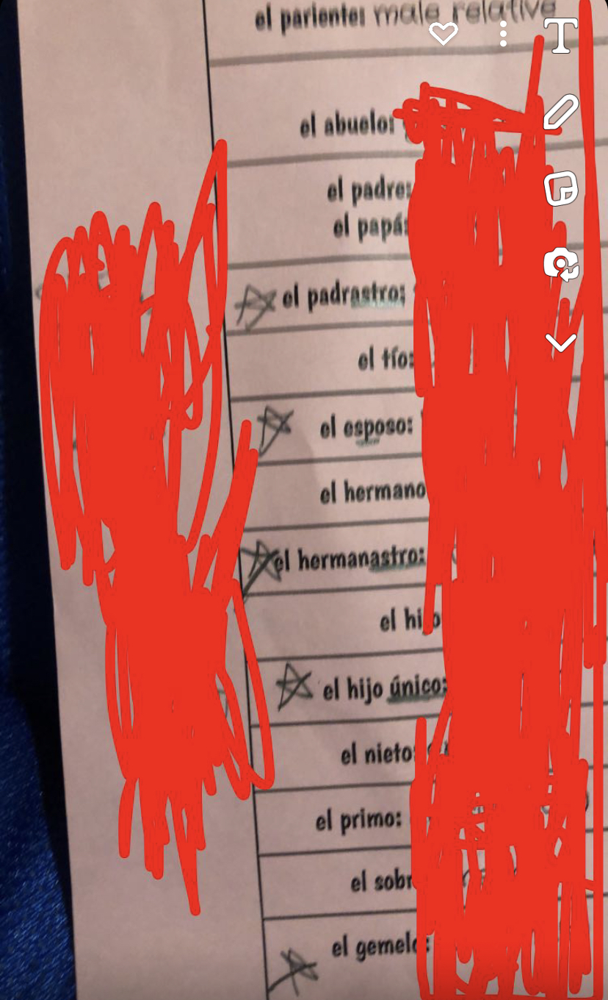

# Overview
This project is a language learning application designed to facilitate Spanish language learning through interactive methods. Built using JavaFX for its graphical user interface and integrated with a translation
API this application offers three different ways to go about learning. Each different screen aims to give the user a different way of learning, but they all provide quick real time translations. This is meant to be a learning tool for children up to grade nine.

# Features
* JavaFX GUI: Employs user friendly interface across all three screens, and ensures intuitive navigation.
* API integration: Utilizes MyMemory translation API to provide quick and accurate translations of English words to Spanish.
* Matching Game: Challenges users by having the user input English words and seeing possible Spanish words appear. The user is challenged to enter which words they think match.
* Spelling Game: Challenges the user to type the Spanish translation of a English word with no help. Every time the user gets a guess wrong one letter of the Spanish word will appear until the user guesses the word or the entire word is shown to the user.
* Translation Game/Section: This section is just for pure translations, if the user feels the need to have a quick translation and not have to play either of the games they can do that on this screen.

# Purpose
As a child Spanish never came easily to me and I would end up using Quizlet, but I never liked how you have to enter the English word but then also enter the Spanish word. So, since my siblings are now entering
their journey with Spanish I wanted to make a applicaiton that would ease the process for them. I added games that I would have wanted as a Spanish student; I don't want my siblings to have to take a picture of a 
practice sheet and hide the Spanish translations or have to write down a lot of flash cards.

My experience:

# Future Plans
* Add more languages for children who don't take a Spanish class.
* Make a more advanced section for full sentences.
* Enhance the GUI overall

# Video 
